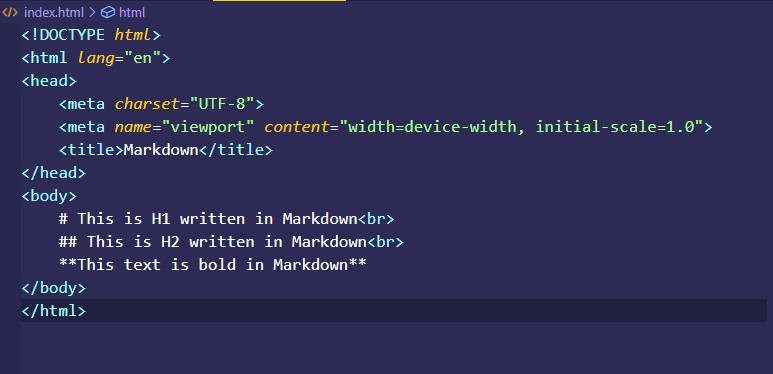
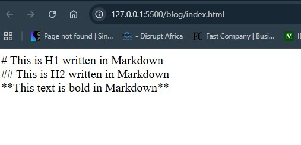
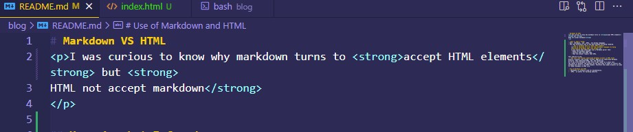
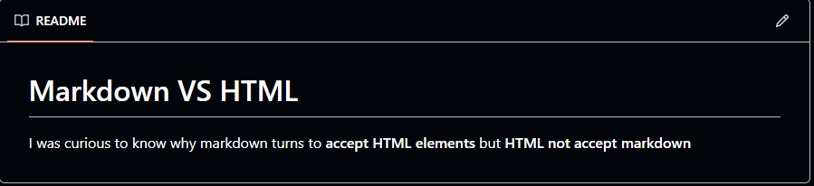

# Markdown VS HTML

I was curious to know why markdown turns to <strong>accept HTML elements</strong> but <strong>
HTML do not accept markdown</strong>

## Here is what I found:
- Both *_Markdown_* and *_HTML_* are markup languages.
- The real difference lies in how both markups are being rendered.
    ### How is Markdown able to render HTML element?
    
From my learning it turns out that markdown language are being understood by Markdown apps like GitHub.

    I also learnt that, these apps uses a Markdown parser that:
    - Reads the Markdown symbols.
    - Converts them into HTML code.
    - Then the browser renders that HTML.

This lead me to ask,
### Why can't the browsers understand markdown written in HTML file?
Usually, browsers like Chrome, Firefox, Edge do not understand Markdown directly. They understand HTML, CSS, and JavaScript.
So if you write markdown in HTML file it get render as a plain text.
The reason is because, the browsers do not have what it takes to convert the markdown and return it as HTML element. Therefore this makes browsers not able to render markdown in HTML file.

# Use of Markdown and HTML
- __Markdown__is normally used for documentation.
- __HTML__ is useful for building websites.

# Images of Markdown VS HTML
## Snapshot Of HTML

## Snapshot Of Markdown

# 🤷‍♂️ Do you think in the future, browsers will be made to understand Markdown???
Let discuss that later.
